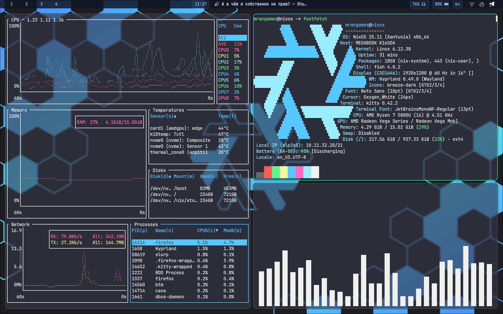
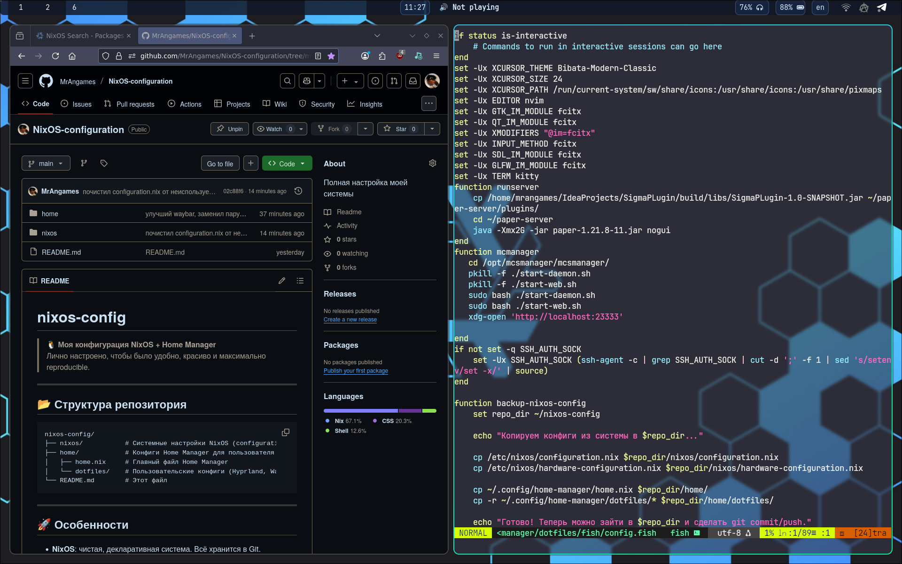

# nixos-config

> 🐧 **Моя конфигурация NixOS + Home Manager**  
> Лично настроено, чтобы было удобно, красиво и максимально reproducible.

---
## 🖼️ Внешний вид





---

## 📂 Структура репозитория

```
nixos-config/
├── nixos/           # Системные настройки NixOS (configuration.nix, hardware-configuration.nix)
├── home/            # Конфиги Home Manager для пользователя
│   ├── home.nix     # Главный файл Home Manager
│   └── dotfiles/    # Пользовательские конфиги (Hyprland, Waybar, Fish и др.)
└── README.md        # Этот файл
```

---

## 🚀 Особенности

- **NixOS**: чистая, декларативная система. Всё хранится в Git.
- **Home Manager**: управляет dotfiles и пользовательскими настройками.
- **Hyprland**: современный window manager для Wayland.
- **Fish shell**: удобный и красивый терминал.
- **Waybar, Kitty**: кастомные конфиги для комфорта.
- **Лёгкость переноса**: достаточно клонировать и применить.

---

## ⚡️ Быстрый старт

1. **Клонируй репозиторий:**
   ```bash
   git clone https://github.com/MrAngames/NixOS-configuration.git ~/nixos-config
   sudo cp ~/nixos-config/nixos/* /etc/nixos/
   sudo mkdir -p ~/.config/home-manager
   sudo cp ~/nixos-config/home/* ~/.config/home/manager
   ```

2. **Применяй системные настройки:**
   ```bash
   sudo nixos-rebuild switch
   ```

3. **Настрой Home Manager:**
   ```bash
   home-manager switch
   ```

---

## 📌 Описание папок

- `nixos/` — файлы для системной части: `configuration.nix`, `hardware-configuration.nix`, опционально флейк.
- `home/` — пользовательские настройки через [Home Manager](https://nix-community.github.io/home-manager/).
  - `configuration.nix` — основной файл.
  - `dotfiles/` — отдельные конфиги: Hyprland, Waybar, Fish, и др.

---

## 💡 Полезные ресурсы

- [NixOS Manual](https://nixos.org/manual/)
- [Home Manager](https://nix-community.github.io/home-manager/)
- [Hyprland Wiki](https://wiki.hyprland.org/)

---

## 🏳 Контакты и обратная связь

Если хочешь со мной связаться, лучше пиши в [тг](https://t.me/Mr_Angames_me)

---

**Made with ❤️ and fish 🐟**
